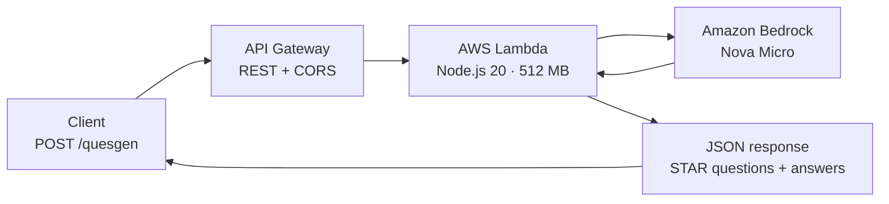

# Questions-Generator-API


**Serverless AI API that turns any job description into STAR-style technical interview questions — with expected answers.**

Paste a job description, get back structured interview questions generated by **Amazon Bedrock** (Amazon Nova Micro) via a REST endpoint. No servers to manage: AWS Lambda + API Gateway + Infrastructure-as-Code with AWS CDK.

## Architecture



| Component | Choice |
|---|---|
| Compute | AWS Lambda (`NodejsFunction`, Node.js 20.x, 512 MB, 2 min timeout) |
| API | API Gateway REST API — `POST /quesgen` with CORS enabled |
| AI | Amazon Bedrock Converse API — `us.amazon.nova-micro-v1:0` |
| IaC | AWS CDK v2 (TypeScript) |

## Quick start

### Call the API

```bash
curl -X POST https://<api-id>.execute-api.us-east-1.amazonaws.com/prod/quesgen \
  -H "Content-Type: application/json" \
  -d '{ "hrsJobDesc": "We are hiring a backend engineer with 3+ years of Node.js, REST APIs, PostgreSQL and AWS experience..." }'
```

The response is a JSON array of STAR-style interview questions with expected answers, grounded in the given job description.

### Deploy your own stack

```bash
npm install
npm run build          # compile TypeScript

aws configure          # credentials with Lambda + Bedrock + CloudFormation permissions
npx cdk bootstrap      # one-time per account/region
npx cdk deploy         # prints the ApiEndpoint URL when done
```

> The Lambda's IAM role needs `bedrock:InvokeModel` access; the stack grants it automatically.

### Local development

```bash
npm install
npm run test           # jest unit tests
npm run watch          # compile on change
npx cdk synth          # inspect the synthesized CloudFormation template
```

## Project structure

```text
bin/questions-generator-api.ts     CDK app entry point
lib/questions-generator-api-stack.ts   Stack: Lambda + API Gateway + IAM
src/function/handler.ts            Lambda handler (request validation, CORS)
src/service/quesGen.service.ts     Bedrock integration + prompt engineering
src/model/quesGen.model.ts         Request/response models
test/                              Jest unit tests
```

## Design notes

- **Prompt engineering** — the system prompt enforces STAR format (Situation, Task, Action, Result) and requires expected answers, so output is directly usable by interviewers.
- **Cost-efficient model** — Amazon Nova Micro keeps per-request cost near-zero while staying fast enough for interactive use.
- **Fail fast** — missing `hrsJobDesc` returns `400` before invoking Bedrock; Bedrock errors map to `500` and are logged with the AWS SDK logger.
- **IaC-first** — every resource (Lambda, API, IAM policy) is defined in CDK, so the whole backend is reproducible with `cdk deploy`.

## License

MIT
